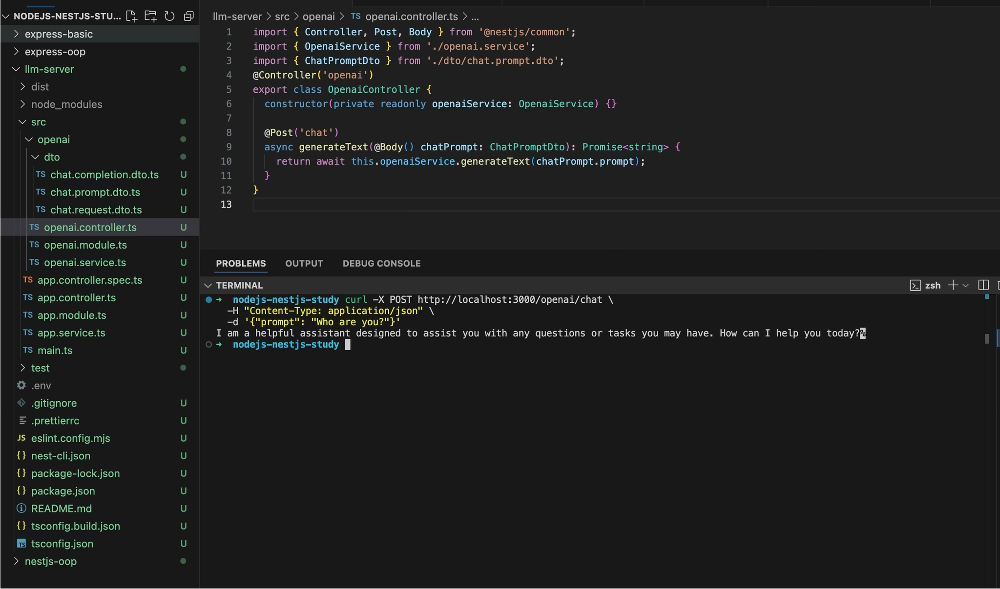

# Chapter3 과제 제출 보고서

## 1. 프로젝트 명

**OpenAI API를 활용한 LLM 백엔드 서버 구현**

---

## 2. 학습 목표 반영 내용

### 2.1 REST API 기본 개념과 인증 메커니즘 이해

본 프로젝트는 클라이언트가 HTTP 요청을 보내고 서버가 응답을 반환하는 REST API 구조로 구현했습니다.

OpenAI API 인증은 API Key 기반으로 처리했습니다. API Key는 코드에 직접 작성하지 않고 `.env` 파일의 `OPENAI_API_KEY` 환경 변수로 관리했습니다. Git에는 실제 Key가 포함되지 않도록 `.gitignore`에 `.env`를 등록했습니다.

### 2.2 curl과 Postman을 활용한 API 테스트

다음 테스트 방식을 포함했습니다.

| 테스트 방식 | 파일/명령 |
|---|---|
| curl | `scripts/test-chat.sh` |
| curl JSON 응답 | `scripts/test-chat-json.sh` |
| Postman | `postman/chapter3-openai-llm-server.postman_collection.json` |

### 2.3 NestJS 아키텍처와 OOP 구조 구현

NestJS의 Controller, Service, Module 구조를 적용했습니다.

| 계층 | 역할 | 파일 |
|---|---|---|
| Controller | HTTP 요청 수신 및 DTO 매핑 | `src/openai/openai.controller.ts` |
| Service | OpenAI API 호출 및 비즈니스 로직 처리 | `src/openai/openai.service.ts` |
| Module | OpenAI 기능 단위 모듈화 | `src/openai/openai.module.ts` |

### 2.4 DTO 검증과 로깅 구현

DTO에는 `class-validator`를 적용했습니다. `prompt`는 문자열, 필수값, 최소 길이, 최대 길이 조건을 갖습니다.

로깅은 두 가지 방식으로 구현했습니다.

| 로깅 방식 | 설명 |
|---|---|
| Interceptor | 요청 처리 시간 콘솔 출력 |
| Middleware | 요청 Method, URL, Status Code, 처리 시간을 파일로 저장 |

---

## 3. API 엔드포인트 설계

| Method | Endpoint | 설명 | 응답 형태 |
|---|---|---|---|
| GET | `/health` | 서버 상태 확인 | JSON |
| GET | `/openai/status` | OpenAI 모듈 상태 확인 | JSON |
| POST | `/openai/chat` | 질문 입력 후 답변 문자열 반환 | Text |
| POST | `/openai/chat-json` | 질문 입력 후 구조화된 JSON 반환 | JSON |
| POST | `/openai/chat-messages` | system/user/assistant 메시지 배열 기반 답변 반환 | Text |

---

## 4. 핵심 구현 코드 요약

### 4.1 Controller

```ts
@Post('chat')
async generateText(@Body() chatPrompt: ChatPromptDto): Promise<string> {
  return await this.openaiService.generateText(chatPrompt.prompt);
}
```

### 4.2 DTO

```ts
export class ChatPromptDto {
  @IsString()
  @IsNotEmpty()
  @MinLength(2)
  @MaxLength(2000)
  prompt: string;
}
```

### 4.3 Service

```ts
const response = await this.client.responses.create({
  model,
  input: prompt,
});

return response.output_text.trim();
```

---

## 5. 실행 및 테스트 결과

### 5.1 서버 실행

```bash
npm run start:dev
```

### 5.2 curl 테스트

```bash
curl -X POST http://localhost:3000/openai/chat \
  -H "Content-Type: application/json" \
  -d '{"prompt":"Who are you?"}'
```

예상 결과:

```text
I am a helpful assistant designed to assist you with any questions or tasks you may have.
```

### 5.3 테스트 이미지



---

## 6. 제출 파일 구성

```text
README.md
.env.example
package.json
src/openai/openai.controller.ts
src/openai/openai.service.ts
src/openai/openai.module.ts
src/openai/dto/*.ts
src/openai/interfaces/*.ts
src/common/interceptors/request-logger.interceptor.ts
src/common/middleware/request-logger.middleware.ts
postman/chapter3-openai-llm-server.postman_collection.json
scripts/test-chat.sh
scripts/test-chat-json.sh
docs/assignment-report.md
docs/images/api-test-result.png
```

---

## 7. 결론

본 프로젝트는 Chapter3 과제 요구사항인 OpenAI API Key 환경 설정, REST API 설계, curl/Postman 테스트, NestJS 서버 개발, DTO 검증, Interface 적용, OpenAI API 연동, 로깅 시스템을 모두 포함합니다.

---

## 8. 추가 구현: RAG 및 Redis Vector Search

기본 OpenAI 질문/응답 API 외에 강의 backend 자료의 RAG 흐름을 참고하여 Redis Stack 기반 검색 증강 생성 기능을 추가했습니다.

| 구분 | 구현 내용 | 관련 파일 |
|---|---|---|
| Redis 연결 | Redis Stack 연결 및 Lazy Connection 처리 | `src/infra/redis/redis.service.ts` |
| Vector Index | RediSearch `FT.CREATE` 기반 벡터 인덱스 생성 | `src/infra/redis/redis.service.ts` |
| 문서 인덱싱 | `src/rag/*.txt` 문서를 청크 단위로 분할 후 임베딩 저장 | `src/openai/openai.service.ts` |
| Embedding | OpenAI Embedding API 사용 | `src/openai/openai.service.ts` |
| RAG API | 질문 임베딩 → Redis Vector Search → 문맥 구성 → LLM 답변 생성 | `POST /openai/rag` |
| 초기화 API | 기존 벡터 인덱스 삭제 후 문서 재색인 | `POST /openai/reset-rag` |

### 8.1 추가 API

| Method | Endpoint | 설명 |
|---|---|---|
| POST | `/openai/rag` | RAG 기반 질문/응답 |
| POST | `/openai/reset-rag` | Redis 벡터 인덱스 초기화 및 문서 재색인 |

### 8.2 RAG 테스트 명령

```bash
curl -X POST http://localhost:3000/openai/reset-rag

curl -X POST http://localhost:3000/openai/rag \
  -H "Content-Type: application/json" \
  -d '{"prompt":"운영체제에서 프로세스와 스레드 차이를 설명해줘.","topK":3}'
```

### 8.3 설계상 주의점

RAG 기능은 Redis Stack의 RediSearch, RedisJSON 기능에 의존합니다. 따라서 일반 Redis 서버만 실행하면 벡터 검색이 동작하지 않을 수 있습니다. 기본 OpenAI Chat API는 Redis 없이도 사용할 수 있도록 RAG 자동 인덱싱은 기본값 `false`로 설정했습니다.
